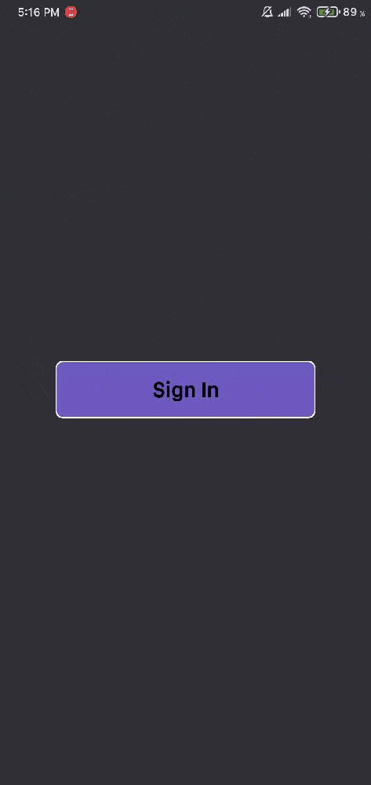

# Rn-Auth


<div align="center">
    
</div>

> Autenticação com React Native CLI com redux persist para persistir o usuário logado

## 🚀 Tecnologias Usadas

- React Native CLI
- Redux
- Redux Persist

## 💻 Pré-requisitos

**Clone o projeto e entre na pasta**

```bash
$ git clone https://github.com/gustavo867/rn-auth && cd rn-auth
```

**Siga os passos abaixo**

```bash
# Instale as dependencias
$ yarn or npm

# Se você for usar o emulador do android rode esse comando
$ npx react-native run-android

# Se for emulador ios rode sse comando
$ npx react-native ios

```

## 📫 Contribuindo para rn-auth

Para contribuir com rn-auth, siga estas etapas:

1. Bifurque este repositório.
2. Crie um branch: `git checkout -b <nome_branch>`.
3. Faça suas alterações e confirme-as: `git commit -m '<mensagem_commit>'`
4. Envie para o branch original: `git push origin rn-auth / <local>`
5. Crie a solicitação de pull.

Como alternativa, consulte a documentação do GitHub em [como criar uma solicitação pull](https://help.github.com/en/github/collaborating-with-issues-and-pull-requests/creating-a-pull-request).

## 📝 Licença

Esse projeto está sob licença. Veja o arquivo [LICENÇA](LICENSE.md) para mais detalhes.

Feito com amor 💜 por Gustavo Santana 👋 [Veja meu linkedin](https://www.linkedin.com/in/gustavo-santana-83ba611a6/)
